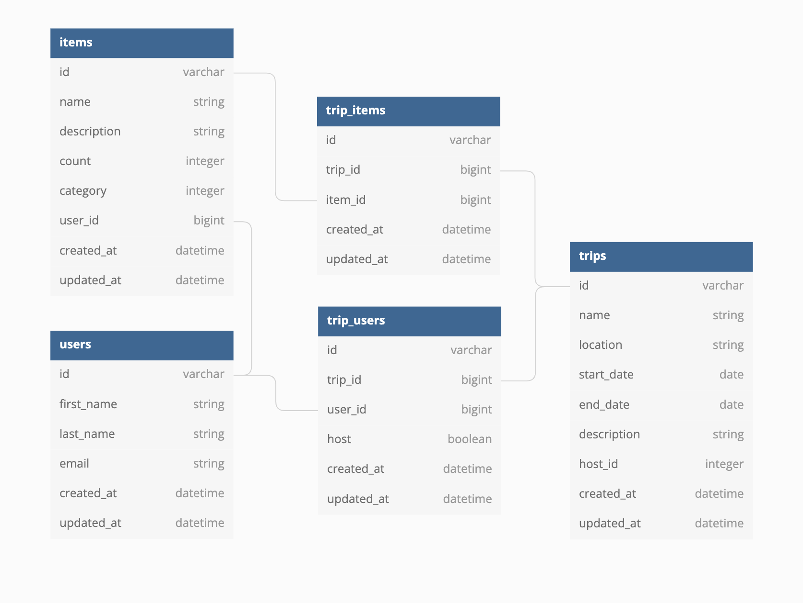

# Gear Up

<!-- ALL-CONTRIBUTORS-BADGE:START - Do not remove or modify this section -->

<!-- ALL-CONTRIBUTORS-BADGE:END -->

  

## General Description

Logistics for group adventures outdoors can be complicated, especially when it comes to getting all of your gear in order. __Gear Up__ simplifies this by giving users a platform to easily organize trips, decide who is bringing what gear, then determine what the group still needs and who might have that gear already!

Using __Gear Up__, users are able to:

- Register or sign-in using Google OAuth
- Add items to their __"shed"__, a list of __all gear__ that user has available
- Search for and select a __location__ for your trip
  - In doing the step above, determine the __weather__, allowing the user to think on what gear is needed
- __Invite other users__ to the trip
- The host as well as all invited users can then __select what gear__ from their __"shed"__ they'd like to __commit to the trip__
- From there, users can determine what gear is __already covered__ and what gear is __still missing__ based on what the users have __already committed__!

## Schema

  

